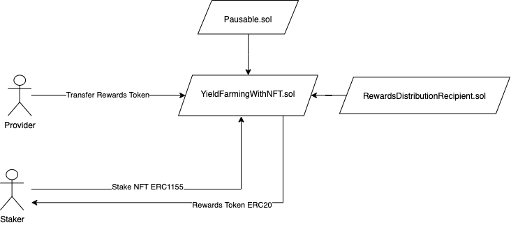

<!-- Ghost Brand -->
 

<h3 align="center">Game Farming by Luan Pontolio</h3>

     

# About

`Game-Farming` is a simple bounty project based on game items.

The project allows users to redeem rewards for each NFT item they put in the Pool. When creating a new position, the `Staker` start to earn a project token(`RKN`). The image below shows us how this works:

    

#### Contracts Design

- Pausable: The contract pauses the rewards distribution by the owner(`RewardsDistribution`).
- RewardsDistributionRecipient: To add and verify a new RewardsDistribution.
- YieldFarmingWithNFT: Primarily contract. Its initialization parameters have cared for `RewardsToken`, `StakeToken`, and `RewardsDistribution`. In its initialized state with the `RKN` distribution period of seven days(only the `RewardsDistribution` has the authority to change the period). If staked a new NFT in the contract, the `_totalSupply` receives `1 ether`(for each successful `stake`), and the user increases their balance for each NFT added.

# Setup checklist

- [ ] Node 16.14.2
- [ ] Yarn 1.22.19
# Metamask

1. Be sure to have metamask plugin installed in your browser (recommended browser is Chrome)
2. Login to Metamask and point the network to localhost and port 7545 before starting the frontend app
3. Install ganache `https://trufflesuite.com/ganache/`.

## Quickstart: Running local

1. Open a new terminal window and run `git clone https://github.com/luanpontolio/game-farming && cd game-farming`
2. run `yarn` to install backend dependencies
3. run `yarn test` to run contract test suite to run smart contract test cases
4. run `DEPLOY_PATH=scripts/deploy.ts yarn deploy:local` to compile and deploy the Game-Farming contracts to the ganache node
5. cd to frontend `cd frontend`
6. run `yarn` to install frontend dependencies
7. run `yarn dev` to serve the app locally

## Environment Setup

#### Quickstart Setup

- [ ] Install all dependencies
- [ ] Deploy a local ethereum network with Ganache
- [ ] Compile and deploy smart contract to the blockchain
- [ ] Contract `artifact` and `typechain` is auto generated in the `frontend` folder

#### Terminal Setup Checklist

- [ ] Terminal 1 - React Front End for the dapp
- [ ] Terminal 2 - If you not running with Ganache interface, you can run `npx ganache-cli -p 7545 -e 100000000000 -l 10000000000000`

#### Dapp Setup Checklist

- [ ] Deploy the local ganache
- [ ] Metamask set to the network you are developing to (localhost:7545 for local, testnet of choice)
- [ ] Run a local react server

#### Smart Contract Development Setup Checklist

- [ ] Contract and other dependencies are in the same folder

## Tutorials

#### Deploying contracts in Local

1. Ensure your local environment has been set up (ganache node, truffle console)
2. Run `yarn test` to ensure all tests are passing (make sure you have the setup your local environment first)
3. Make sure your ganache is running and open `localhost:7545`
4. If tests are passing running `DEPLOY_PATH=scripts/deploy.ts yarn deploy:local`
5. The contracts addresses and the owner address will show up on terminal.
6. Run the dApp: `cd frontend && yarn dev`
7. Change your metamask network to `localhost`
8. The Game-Farming dApp UI should load
#### Resources

[HardHat Documentation](https://hardhat.org/getting-started/) - Hardhat tutorials, config, network, and plugin references

## Troubleshooting

1. Error: Cannot use JSX unless the '--jsx' flag is provided

- Follow: https://vscode.readthedocs.io/en/latest/languages/typescript/#using-the-workspace-version-of-typescript - "Using the workspace version of TypeScript" section

2. Warning: Calling an account which is not a contract

- Compile and deploy your contract first. Run `npm run deploy:local` for local deployments.

## Guidelines:

- Name your branches starting with branchName. Ex. doingSomethingNew or fixSomething.
